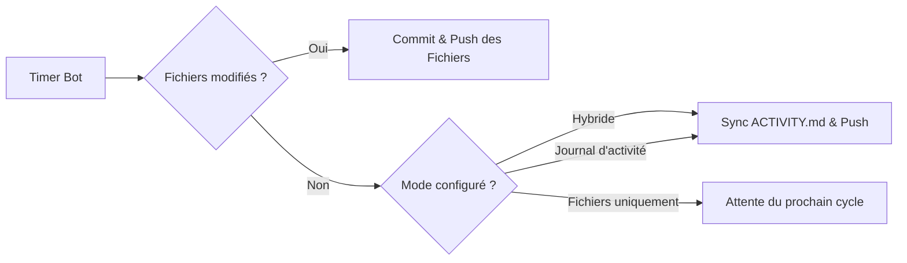

<div align="center">

# ⚡ GitPulse — Bot Auto-Commit & Auto-Push

<p align="center">
  <b>Automation d'Auto-Push Git avec Dashboard Web Dark Glassmorphic, IA de Commits & Tray Manager Windows</b>
</p>

[](https://github.com/physxhousefr/GitPulse)
[](https://python.org)
[](https://flask.palletsprojects.com/)
[](#-interface-graphique)
[](https://microsoft.com)
[](./LICENSE)

<br/>

[📌 Vue d'ensemble](#-vue-densemble) •
[✨ Fonctionnalités](#-fonctionnalités-phares) •
[🚀 Installation](#-installation--démarrage) •
[⚙️ Modes](#-modes-dauto-commit) •
[🛠️ Architecture](#%EF%B8%8F-structure-du-projet) •
[❓ FAQ](#-faq--dépannage)

---

</div>

## 🌟 Vue d'Ensemble

> [!NOTE]
> **GitPulse** est une suite logicielle autonome pour Windows qui automatise l'envoi intelligent de vos commits et pushes Git (GitHub, GitLab, Gitea) sans perturber vos sessions de code.

Doté d'un **Dashboard Web réactif au style Cyberpunk / Dark Glassmorphism**, d'une console de logs temps réel via **SSE**, d'un gestionnaire dans la **barre des tâches Windows (System Tray)** et d'un moteur de génération de messages de commit intelligents par analyse de diff, GitPulse garde vos dépôts actifs et votre profil GitHub synchronisé en tâche de fond.

---

## ✨ Fonctionnalités Phares

### 🎨 Dashboard Web Dark Glassmorphism
- **Interface Next-Gen** : Thème sombre néon avec verre dépoli (`backdrop-filter`), jauges d'activité et boutons d'action instantanés.
- **Console Temps Réel (SSE)** : Stream de logs en direct depuis le bot avec formattage structuré `[-] gitpulse : message`.
- **Grille de Contribution 365 jours** : Heatmap d'activité générée directement à partir de vos dépôts Git réels avec survol interactif.

### 📌 Intégration System Tray Windows
- **Discrétion totale** : L'application se loge dans la zone de notification Windows (à côté de l'heure `^`).
- **Menu d'action rapide** :
  - 🌐 *Ouvrir le Dashboard Web* (`http://127.0.0.1:5050`)
  - 🟢 / 🔴 *Basculer le Bot (Actif / Pause)*
  - ⚡ *Forcer Commit & Push Tout*
  - ❌ *Quitter GitPulse*

### 🧠 Moteur d'Auto-Commit Intelligent
- **Analyse de Diff Automatique** : Détection des extensions et du contenu des fichiers pour catégoriser les commits :
  - 📝 Docs ➔ `docs(readme): update documentation`
  - ✨ Code ➔ `feat(core): update source logic`
  - 🎨 Styles ➔ `style(ui): adjust layout design`
  - 🔧 Config ➔ `chore(config): update build settings`
- **Styles modulables** : Formats *Conventionnel Intelligente*, *Emoji Intelligente* (`✨ feat:...`), ou *Modèle Texte Personnalisé*.

### 🤫 Exécution Silencieuse & Aléatoire
- **0 Clignotement Console** : Exécution arrière-plan avec le flag système `CREATE_NO_WINDOW`.
- **Anti-Détection Jitter** : Intervalle de commit aléatoire paramétrable (ex: 5 à 45 min) pour simuler une activité de développement naturelle.

---

## 🚀 Installation & Démarrage

### 1. Prérequis
- **Windows 10 / 11**
- **Python 3.10+** (Recommandé : Python 3.12 ou 3.13)
- **Git CLI** installé et configuré (`git config --global user.name` et `user.email`)

### 2. Installation Rapide

```bash
# 1. Cloner le dépôt
git clone https://github.com/physxhousefr/GitPulse.git
cd GitPulse

# 2. Installer les dépendances Python
pip install -r requirements.txt
```

### 3. Modes de Lancement

| Méthode | Commande | Description |
| :--- | :--- | :--- |
| **GUI Setup Manager** *(Recommandé)* | `python setup.py` | Interface Tkinter complète pour gérer l'Autostart, les dépendances et le service |
| **Démarrage Silencieux** | `python main.py --autostart` | Lancement direct en arrière-plan avec icône System Tray |
| **Démarrage Interactif** | `python main.py` | Démarre le bot et ouvre le Dashboard Web (`http://127.0.0.1:5050`) |

> [!TIP]
> Lancez `python setup.py` pour créer en un clic le **raccourci sur votre Bureau** et activer le **démarrage automatique au lancement de Windows**.

---

## ⚙️ Modes d'Auto-Commit



| Mode | Comportement |
| :--- | :--- |
| **Hybride** *(Recommandé)* | Pousse vos modifications de code réelles. Si le dépôt est propre, met à jour `ACTIVITY.md` pour conserver la régularité. |
| **Fichiers Modifiés** | Ne déclenche un commit & push **que si des changements réels** sont détectés dans le workspace. |
| **Journal d'Activité** | Génère uniquement une entrée d'activité dans `ACTIVITY.md` sans modifier vos fichiers de code. |

---

## 🛠️ Structure du Projet

```text
GitPulse/
├── main.py                  # Point d'entrée principal (Flask Web Server & System Tray)
├── setup.py                 # Interface GUI de gestion (Setup, Autostart & Service Control)
├── setup_autostart.py       # Configuration autonome du Registre Autostart Windows
├── requirements.txt         # Dépendances Python (Flask, pystray, Pillow, customtkinter)
├── config.example.json      # Modèle de configuration par défaut
├── LICENSE                  # Licence Open-Source MIT
├── README.md                # Documentation officielle
│
├── core/                    # Moteur Python Back-end
│   ├── config_manager.py    # Persistance de configuration JSON & Repos
│   ├── git_manager.py       # Wrapper Git CLI, détection de branche & analyse diff
│   ├── scheduler.py         # Planificateur de tâches & serveur d'événements SSE
│   └── tray_manager.py      # Gestionnaire d'icône Windows System Tray
│
├── static/                  # Assets Frontend
│   ├── css/style.css        # Stylesheet Dark Glassmorphism
│   ├── js/app.js            # Dashboard Client JS (SSE Logs, Heatmap, Modals)
│   └── images/
│       ├── tray_icon.png    # Icône HD de la barre des tâches
│       └── tray_icon.ico    # Icône binaire multi-résolution Windows
│
└── templates/               # Templates HTML5
    └── index.html           # Vues HTML du Dashboard Web
```

---

## ❓ FAQ & Dépannage

<details>
<summary><b>💬 Comment arrêter proprement le bot en arrière-plan ?</b></summary>
<br/>
Faites un clic droit sur l'icône GitPulse située dans la zone de notification Windows (à côté de l'heure <code>^</code>) et sélectionnez <b>Quitter GitPulse</b>. Vous pouvez également ouvrir <code>python setup.py</code> et cliquer sur <b>⏹ Arrêter GitPulse</b>.
</details>

<details>
<summary><b>🔒 Mes identifiants Git et tokens sont-ils stockés par le bot ?</b></summary>
<br/>
Non. GitPulse ne stocke aucun identifiant, jeton ou mot de passe. Il s'appuie directement sur votre exécutable <code>git</code> local et vos clés SSH ou le <i>Windows Git Credential Manager</i> déjà configurés sur votre ordinateur.
</details>

<details>
<summary><b>🛡️ Mes données et chemins personnels sont-ils publiés sur GitHub ?</b></summary>
<br/>
Non. Le fichier de configuration <code>config.json</code> (contenant vos dossiers de projets) ainsi que les fichiers de logs (<code>*.log</code>) sont strictly ignorés via <code>.gitignore</code>.
</details>

<details>
<summary><b>🖥️ Le bot fait-il clignoter des fenêtres consoles pendant que je travaille ?</b></summary>
<br/>
Non. Toutes les opérations système sont exécutées avec le drapeau <code>CREATE_NO_WINDOW</code>, garantissant une discrétion totale sans fenêtres intempestives.
</details>

---

## 📄 Licence

Ce projet est sous licence **MIT**. Voir le fichier [`LICENSE`](./LICENSE) pour plus d'informations.

<div align="center">
  <br/>
  <sub>Projet développé avec passion pour la communauté Open Source • <a href="https://github.com/physxhousefr/GitPulse">GitPulse sur GitHub</a></sub>
</div>
